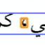
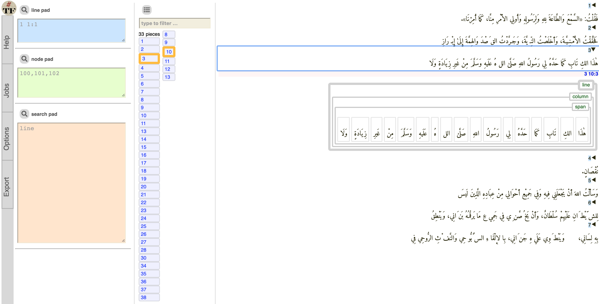
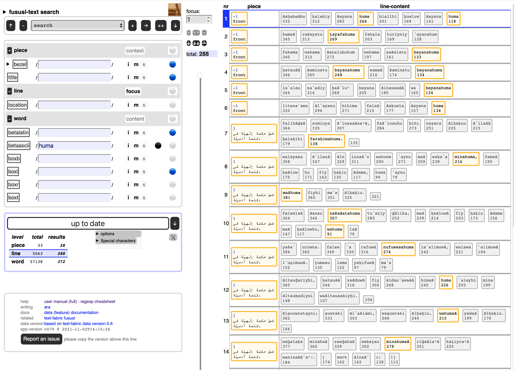

# Fusus-Lakhnawi

This is a
[Text-Fabric](https://github.com/annotation/text-fabric) app
for working with the
[Fusus (Lakhnawi)](https://github.com/among/fusus) corpus: The Bezels of Wisdom by Ibn Arabi, Lakhnawi edition.

Get started with the
[tutorial](https://nbviewer.jupyter.org/github/annotation/tutorials/blob/master/fususl/start.ipynb).

# Search interface to-go

We have generated a search interface for the missieven from the Text-Fabric data.

Just click
[fususl-search](https://annotation.github.io/app-fususl/)
and off you go.

It is experimental.
You can do full text search via regular expressions, not only in the full-text,
but also in attributes of the text, notably the bounding box information of each word.

# Author

[Dirk Roorda](https://github.com/dirkroorda)

